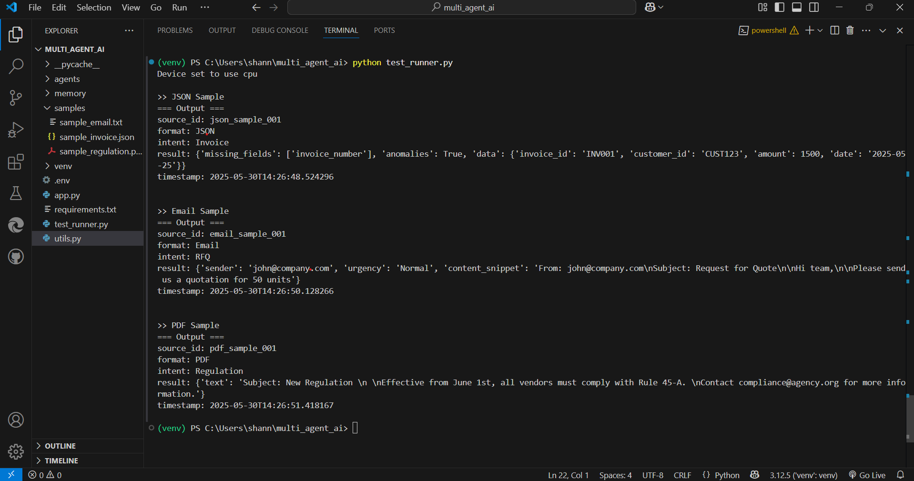

# 🧠 Multi-Agent AI System

This project builds a multi-agent AI system that accepts inputs in **PDF**, **JSON**, or **Email (text)** format. It classifies the input format and intent, routes the input to the correct agent, and logs extracted data using **Redis** for shared memory.

---

## 🚀 Features

- 📦 **Input Formats**: PDF, JSON, Email
- 🧠 **Classifier Agent**: Classifies format and intent
- 🔧 **Routing**: Forwards to Email or JSON Agent
- 📤 **Shared Memory**: Redis backend
- 📄 **PDF Reading**: Extracts text using PyMuPDF
- 🔍 **LLM-Based Classification**: Uses HuggingFace zero-shot model (or custom model)

---

## 📁 Folder Structure
multi_agent_ai/
│
├── agents/
│ ├── classifier_agent.py
│ ├── email_agent.py
│ └── json_agent.py
│
├── samples/
│ ├── invoice.json
│ ├── email_rfq.txt
│ └── sample_regulation.pdf
│
├── utils.py
├── test_runner.py
├── requirements.txt
├── .env
└── README.md

---

## 🔧 Setup Instructions

### 1. Clone the Repo

git clone https://github.com/shannuuu2012/multi-agent-ai.git
cd multi-agent-ai

### 2.Create & Activate Virtual Environment

python -m venv venv
venv\Scripts\activate  # For Windows

### 3.installing dependencies
pip install -r requirements.txt

### 4.Starting the server
redis-cli ping
#### Output should be: PONG
If Redis not running, run redis-server.exe (from installed folder)

### 5.Running the project
python test_runner.py

## 🧪Sample Input files

### 1.sample_invoice.json

{
  "invoice_id": "INV-1001",
  "customer": "ACME Corp",
  "amount": 1250.00,
  "date": "2025-05-30"
}
### 2.sample_email.txt

From: john@company.com
Subject: Request for Quote
9
Hi team,

Please send us a quotation for 50 units of product ABC.

Regards,
John

### 3.Sample_regulation.pdf

Subject: New Regulation 
 
Effective from June 1st, all vendors must comply with Rule 45-A. 
Contact compliance@agency.org for more information. 

# Sample Output
>> JSON Sample
=== Output ===
source_id: json_sample_001
format: JSON
intent: Invoice
result: {'missing_fields': ['invoice_number'], 'anomalies': True, 'data': {'invoice_id': 'INV001', 'customer_id': 'CUST123', 'amount': 1500, 'date': '2025-05-25'}}
timestamp: 2025-05-30T14:26:48.524296

>> Email Sample
=== Output ===
source_id: email_sample_001
format: Email
intent: RFQ
result: {'sender': 'john@company.com', 'urgency': 'Normal', 'content_snippet': 'From: john@company.com\nSubject: Request for Quote\n\nHi team,\n\nPlease send us a quotation for 50 units'}
timestamp: 2025-05-30T14:26:50.128266

>> PDF Sample
=== Output ===
source_id: pdf_sample_001
format: PDF
intent: Regulation
result: {'text': 'Subject: New Regulation \n \nEffective from June 1st, all vendors must comply with Rule 45-A. \nContact compliance@agency.org for more information.'}
timestamp: 2025-05-30T14:26:51.418167
### Terminal Output

